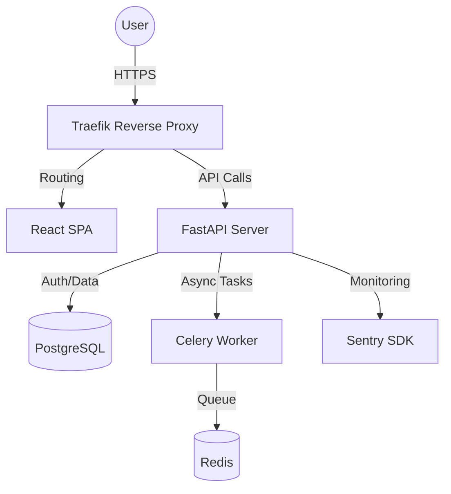
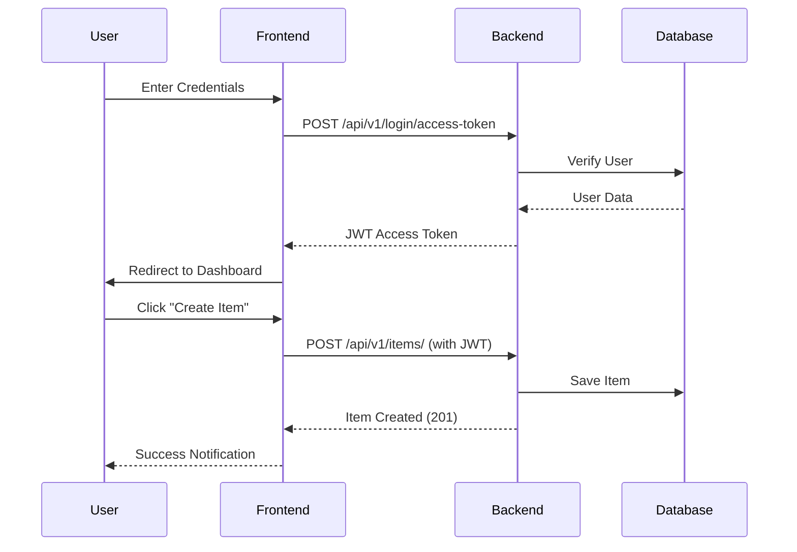

# 🚀 ApexStack: Premium Full-Stack Enterprise Template


ApexStack is a high-performance, production-ready full-stack template designed for modern enterprise applications. It combines the speed of **FastAPI**, the robustness of **PostgreSQL**, and the elegance of **React** with a dark-mode first design system.

## 🌐 Live Demo
- **Live Project Showcase**: [https://saanvirajput.github.io/apex-stack-fastapi/](https://saanvirajput.github.io/apex-stack-fastapi/)


## 🏗️ Architectural Overview



## ⚡ Tech Stack & Features

- **Backend**: FastAPI (Python 3.12+)
  - **ORM**: SQLModel for seamless Type Hinting & DB operations.
  - **Auth**: Secure JWT-based authentication with OAuth2.
  - **Async**: Built-in support for background tasks and web sockets.
- **Frontend**: React (Vite + TypeScript)
  - **Styling**: Tailwind CSS + shadcn/ui.
  - **State**: TanStack Query for robust data fetching.
- **Infrastructure**: Docker Compose (Dev & Prod)
  - **Proxy**: Traefik with automatic Let's Encrypt SSL.
  - **Testing**: End-to-End testing with Playwright.

## 🛠️ User Experience Flow



## 🚀 Getting Started

### 1. Initialize the Stack
```bash
docker compose up -d
```

### 2. Configure Environment
Update the `.env` file with your secret keys:
```env
PROJECT_NAME="ApexStack"
STACK_NAME="apex-stack"
SECRET_KEY="your_generated_secret"
```

### 3. Generate Secret Keys
```bash
python -c "import secrets; print(secrets.token_urlsafe(32))"
```

## 📦 Deployment

This project is optimized for deployment via **Docker Compose** on any VPS or using cloud-native platforms like **DigitalOcean App Platform** or **AWS App Runner**.

Refer to [deployment.md](./deployment.md) for detailed production setup.

---
*Architected and maintained by Saanvi Rajput.*
